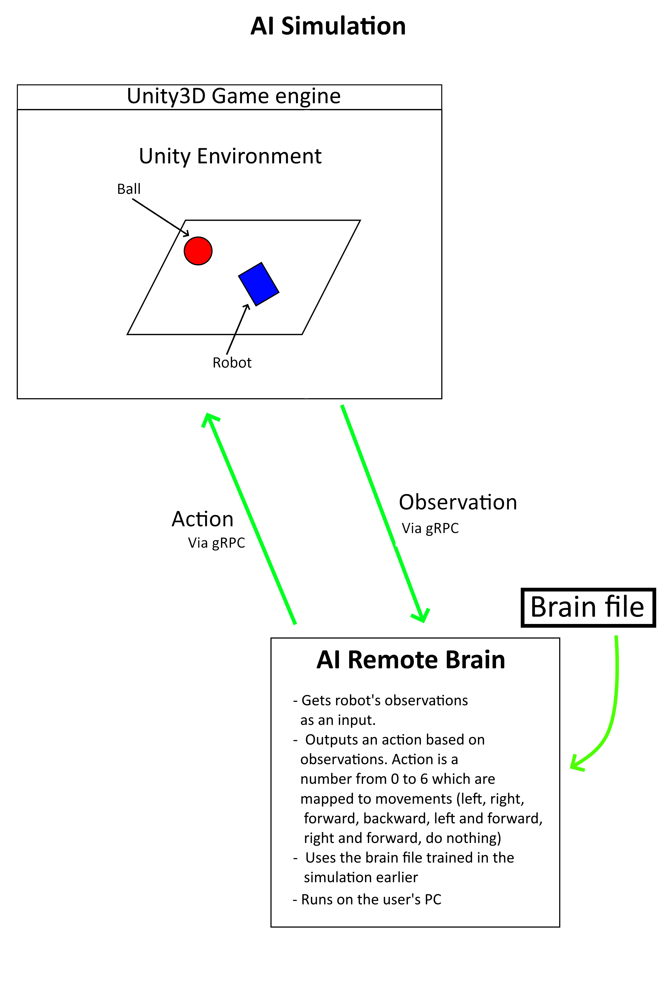

# Driving simulation with AI Remote Brain
This document shows how to drive the simulation with the AI Remote Brain and test that the AI Remote Brain works.

At this point your simulation should be able to run and you should be able to train your agents.

## Use AI Simulator to test AI Remote Brain

1. Use the AI Simulator to train a brain file.
1. Use the `move-brainfile-to-AIRemoteBrain.sh` to move a brain file to AI Remote Brain.
1. Start the AI Remote Brain-project in Unity and load the `AIRemoteBrain`-scene.
1. Press 'Play'-button in AI Remote Brain Unity window.
1. Load the scene `AIRemoteBrainTest`. This scene sends observations to the AI Remote Brain which predicts an action based on the observations using the trained brain file.
1. Press 'Play'-button in AI Simulator Unity window.

## System architecture

